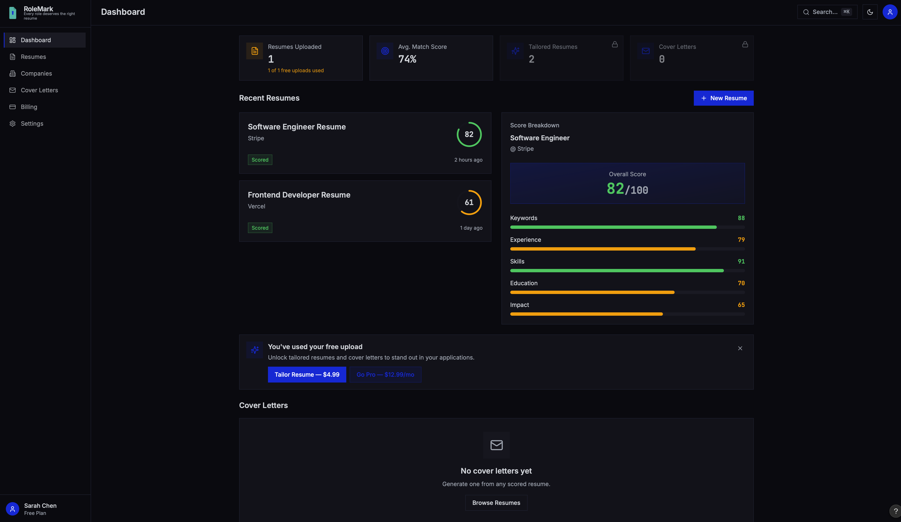

# RoleMark

**Every role deserves the right resume.**

RoleMark is an AI-powered resume scoring and tailoring SaaS that helps job seekers optimize their resumes for specific roles, generate tailored versions, and create compelling cover letters.



## Features

- **AI Resume Scoring** - Upload your resume and job description to get an instant compatibility score with detailed feedback
- **Resume Tailoring** - Generate role-specific resume versions optimized for ATS systems
- **Cover Letter Generation** - AI-powered cover letters with tone customization
- **Rich Text Editor** - Tiptap-based WYSIWYG editor with inline AI assistance
- **Version Management** - Track all versions of your resumes
- **Company Organization** - Organize applications by company
- **Command Bar** - Spotlight-style search (Cmd+K) for quick navigation

## Tech Stack

- **Framework**: Next.js 16 (App Router)
- **Database**: Supabase (PostgreSQL + Auth + Storage)
- **Payments**: Stripe (Subscriptions + One-time purchases)
- **AI**: Vercel AI SDK 6 with AI Gateway
- **Styling**: Tailwind CSS v4 + shadcn/ui
- **Editor**: Tiptap (ProseMirror-based)

## Getting Started

### Prerequisites

- Node.js 18+
- pnpm (recommended) or npm
- Supabase project
- Stripe account

### Installation

```bash
# Clone the repository
git clone https://github.com/TannerBarcelos/rolemark-00.git
cd rolemark-00

# Install dependencies
pnpm install

# Run development server
pnpm dev
```

Open [http://localhost:3000](http://localhost:3000) to view the app.

### Environment Variables

Create a `.env.local` file with the following:

```env
# Supabase
NEXT_PUBLIC_SUPABASE_URL=your_supabase_url
NEXT_PUBLIC_SUPABASE_ANON_KEY=your_supabase_anon_key

# Stripe
STRIPE_SECRET_KEY=sk_test_...
NEXT_PUBLIC_STRIPE_PUBLISHABLE_KEY=pk_test_...
STRIPE_WEBHOOK_SECRET=whsec_...

# App URL (for OAuth callbacks)
NEXT_PUBLIC_APP_URL=http://localhost:3000
```

### OAuth Setup

Configure OAuth providers in Supabase Dashboard under **Authentication > Providers**:

1. **Google**: [Google Cloud Console](https://console.cloud.google.com/) - Create OAuth 2.0 credentials
2. **GitHub**: [GitHub Developer Settings](https://github.com/settings/developers) - Create OAuth App
3. **LinkedIn**: [LinkedIn Developer Portal](https://www.linkedin.com/developers/) - Enable Sign In with OpenID Connect

Callback URL for all providers:
```
https://<your-project-ref>.supabase.co/auth/v1/callback
```

## Project Structure

```
app/
├── api/
│   ├── ai/              # AI endpoints (score, tailor, cover-letter, inline)
│   └── webhooks/stripe/ # Stripe webhook handler
├── auth/                # Login, callback, error pages
├── dashboard/           # Protected dashboard routes
│   ├── resumes/         # Resume management
│   ├── cover-letters/   # Cover letter management
│   ├── companies/       # Company organization
│   ├── billing/         # Subscription management
│   └── settings/        # User settings
└── page.tsx             # Landing page

components/
├── landing/             # Landing page sections
├── dashboard/           # Dashboard layout components
├── resume/              # Resume-specific components
├── editor/              # Tiptap editor components
├── billing/             # Stripe checkout components
└── ui/                  # shadcn/ui components

lib/
├── supabase/            # Supabase client utilities
├── products.ts          # Stripe product catalog
├── paywall.ts           # Subscription/paywall logic
└── feature-flags.ts     # Feature flag configuration
```

## Common Commands

```bash
# Development
pnpm dev              # Start dev server
pnpm build            # Build for production
pnpm start            # Start production server
pnpm lint             # Run ESLint

# Database
# Run SQL migrations in /scripts folder via Supabase Dashboard or CLI
```

## API Reference

| Endpoint | Method | Description |
|----------|--------|-------------|
| `/api/ai/score` | POST | Score resume against job description (free tier) |
| `/api/ai/tailor` | POST | Generate tailored resume (paid) |
| `/api/ai/cover-letter` | POST | Generate cover letter (paid) |
| `/api/ai/inline` | POST | Inline AI editing (paid) |
| `/api/ai/fetch-jd` | POST | Fetch job description from URL |
| `/api/webhooks/stripe` | POST | Stripe webhook handler |

## Pricing Tiers

- **Free**: 1 resume upload + AI scoring
- **One-time**: $4.99 (resume) / $2.99 (cover letter) / $6.99 (bundle)
- **Monthly**: $12.99/mo - Unlimited everything
- **Yearly**: $99.99/yr - Unlimited everything (save 36%)

## Documentation

See [ROLEMARK_PROJECT_SPEC.md](./ROLEMARK_PROJECT_SPEC.md) for comprehensive technical documentation including:
- Complete database schema
- API specifications
- Component architecture
- Future roadmap

## Contributing

1. Fork the repository
2. Create a feature branch (`git checkout -b feature/amazing-feature`)
3. Commit your changes (`git commit -m 'Add amazing feature'`)
4. Push to the branch (`git push origin feature/amazing-feature`)
5. Open a Pull Request

## License

MIT

---

Built with [v0](https://v0.app) | [Continue developing on v0](https://v0.app/chat/projects/prj_NfhVBgSkolh4Q0OnrPpINGkNwKwV)